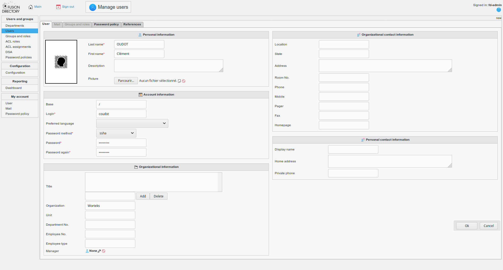
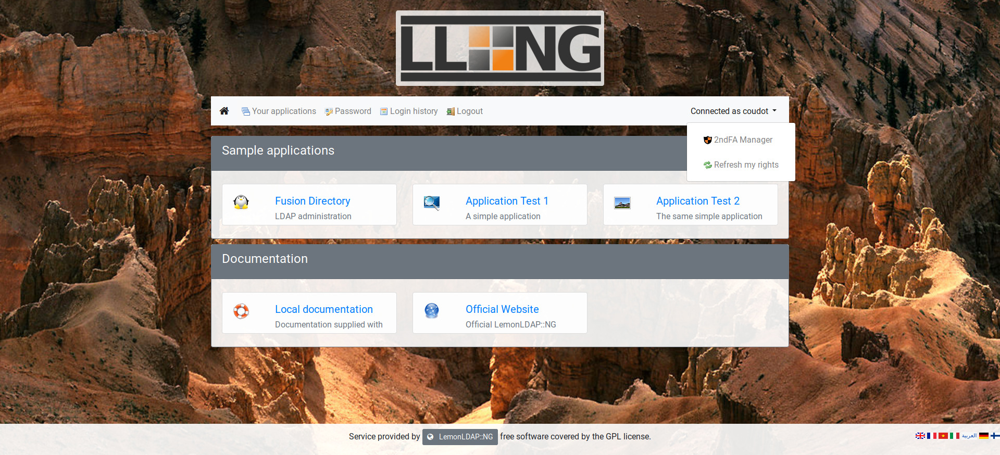
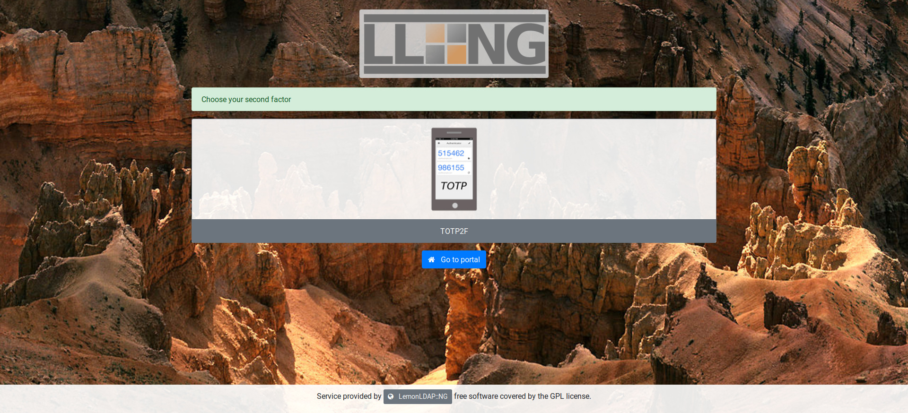
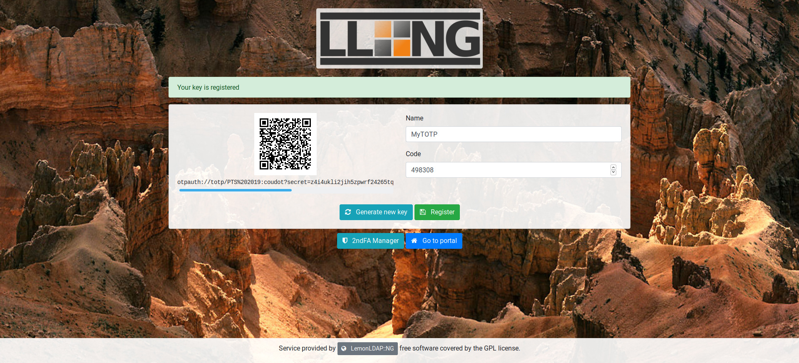
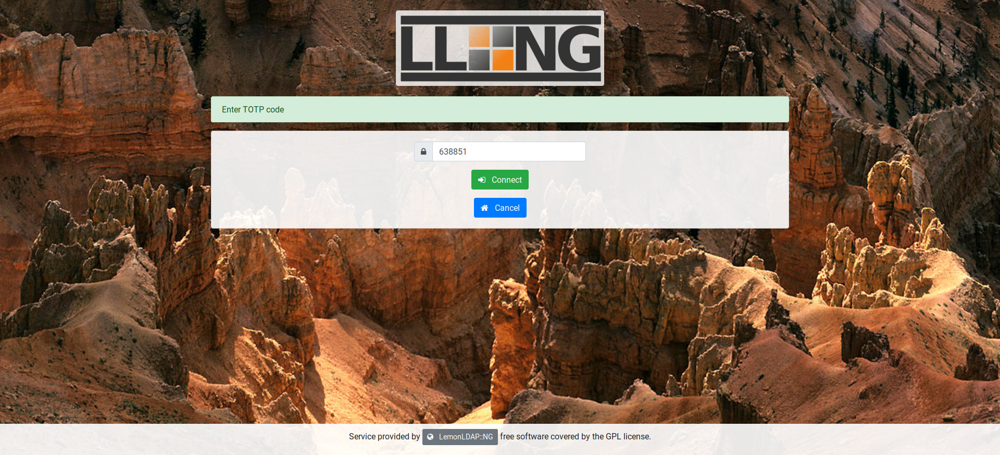

# LemonLDAP::NG Workshop

Workshop on [LemonLDAP::NG](https://lemonldap-ng.org/) for [LDAPCon 2019](https://ldapcon.org/2019/).


Goals:
* Install LemonLDAP::NG
* Configure authentication to OpenLDAP
* Protect sample applications with Handler
* Enable 2FA

Prerequisites:
* Virtualization system (like VirtualBox)
* Internet access from your Virtual Machine (for packages installation)
* Mobile phone with TOTP application (for example [FreeOTP+](https://f-droid.org/en/packages/org.liberty.android.freeotpplus/))

## Virtual image and first checks

Download the virtual image from [Worteks CDN](https://cdn.apps.wopla.io/llng/pts2019.ova) and import it.

After starting the image, you should be able to log in on graphcal inteface with:
:bust_in_silhouette: `worteks`
:key: `password`

And then open a console (`ALT+F2` `konsole`)
```
su -
```

The root password is :key: `password`

:information_source: For practical reasons we will use a browser on local machine to access applications. If you can access your Virtual Machine from your host, you will also be able to use your own browser. In this case, edit your `/etc/hosts` file to map URLs to the IP of your Virtual Machine.

:exclamation: All commands in this documentation must be run as `root` in the console.

### LDAP server

[OpenLDAP LTB](https://ltb-project.org/documentation/openldap-deb) server is already installed, you can check the service status:
```
systemctl status slapd
```

Access to configuration:
```
ldapvi -Y EXTERNAL -h ldapi:/// -b cn=config
```

Access to data:
```
ldapvi -Y EXTERNAL -h ldapi:/// -b dc=worteks,dc=com
```

### LDAP browser

[Fusion Directory](https://www.fusiondirectory.org/) is already installed, you can access it on http://localhost/fusiondirectory/

You should see the following screen:


Log in with:
:bust_in_silhouette: `fd-admin`
:key: `password`

You should see the following screen:


:exclamation: Now you are on your own. Follow the following steps and try to achieve all points!

## LemonLDAP::NG installation

:information_source: See also [official documentation](https://lemonldap-ng.org/documentation/latest/installdeb).

Use official repository:
```
vi /etc/apt/sources.list.d/lemonldap-ng.list
```
```
# LemonLDAP::NG repository
deb     https://lemonldap-ng.org/deb 2.0 main
deb-src https://lemonldap-ng.org/deb 2.0 main
```

Get GPG key:
```
wget -O - https://lemonldap-ng.org/_media/rpm-gpg-key-ow2 | apt-key add -
```

Update:
```
apt update
```

Install main package with Apache mod_perl:
```
apt install libapache2-mod-perl2 lemonldap-ng
```

:information_source: LemonLDAP::NG is of course also compatible with Nginx, but this workshop is designed to run with Apache.

Install Apache FCGID module:
```
apt install libapache2-mod-fcgid
```

Enable modules and configurations:
```
a2ensite manager-apache2.conf
a2ensite portal-apache2.conf
a2ensite handler-apache2.conf
a2enmod fcgid perl alias rewrite headers
```

Configure LL::NG to check configuration every second (avoid to force a restart at each configuration modification):
```
sed -i 's/;checkTime =.*/checkTime = 1/' /etc/lemonldap-ng/lemonldap-ng.ini
```

Test configuration:
```
apachectl configtest
```

Restart Apache:
```
systemctl restart apache2
```

:information_source: We use the default domain `example.com`. It can be changed with the next command:
```
sed -i 's/example\.com/worteks.com/g' /etc/lemonldap-ng/* /var/lib/lemonldap-ng/conf/lmConf-1.json
```

:exclamation: If you do it, adapt the following steps to use your specific domain instead of `example.com`.

## First access

Configure your local DNS or edit your local `/etc/hosts` (on your host, not on the virtual machine) with:
```
127.0.0.1	auth.example.com manager.example.com test1.example.com test2.example.com
```

Then open the web browser and go to http://auth.example.com

You should see the following screen:


Log in with:
:bust_in_silhouette: `dwho`
:key: `dwho`

You should see the following screen:


Click on WebSSO Manager to access the administration interface, or use http://manager.example.com

You should see the following screen:


:information_source: Further configuration steps could be done with this graphical interface, but in this workshop we will use the [Command Line Interface](https://lemonldap-ng.org/documentation/latest/configlocation#command_line_interface_cli):
```
/usr/share/lemonldap-ng/bin/lemonldap-ng-cli help
```

## Access to sample application

LemonLDAP::NG provides a sample application that reads HTTP headers. To enable it:
```
a2ensite test-apache2.conf
systemctl reload apache2
```

You can see that this is a standard Apache virtual host, the only added line it the call the LL::NG Handler:
```
vi /etc/apache2/sites-enabled/test-apache2.conf
```
```apache
    # SSO protection
    PerlHeaderParserHandler Lemonldap::NG::Handler::ApacheMP2
```

Access to the sample application: http://test1.example.com

You should see the following element in the screen:


You are authenticated! If you logout from the WebSSO (http://auth.example.com/logout), and try to access to the sample application, you will be forced to log in.

## LDAP configuration

The WebSSO is currently in [demo mode](https://lemonldap-ng.org/documentation/latest/authdemo), with built-in accounts (do you like [Doctor Who](https://en.wikipedia.org/wiki/Doctor_Who)?). Now we will configure LemonLDAP::NG to use the local LDAP directory.

Use the command line to set LDAP parameters:
```
/usr/share/lemonldap-ng/bin/lemonldap-ng-cli -yes 1 \
    set \
        authentication LDAP \
        userDB LDAP \
        passwordDB LDAP \
        registerDB LDAP \
        ldapServer 'ldap://localhost' \
        managerDn 'cn=websso,ou=dsa,dc=worteks,dc=com' \
        managerPassword 'WebSSOPassword' \
        ldapBase 'ou=users,dc=worteks,dc=com' \
        ldapPpolicyControl 1
```
```
/usr/share/lemonldap-ng/bin/lemonldap-ng-cli -yes 1 \
    addKey \
        ldapExportedVars uid uid \
        ldapExportedVars cn cn \
        ldapExportedVars sn sn \
        ldapExportedVars mail mail \
        ldapExportedVars givenName givenName
```

Now you can connect to SSO portal with the LDAP user:
:bust_in_silhouette: `fd-admin`
:key: `password`

As you can see, access to Manager is not granted anymore. Indeed, this access was configured for user `dwho` and you are not this one anymore!

To restore access to Manager, two options:
1. Remove Manager protection in `/etc/lemonldap-ng/lemonldap-ng.ini` (search `[manager]` section and `protection` parameter)
2. Modify access rules

For the second solution, first remove unused rules:
```
/usr/share/lemonldap-ng/bin/lemonldap-ng-cli -yes 1 \
    delKey \
        locationRules/manager.example.com '(?#Configuration)^/(.*?\.(fcgi|psgi)/)?(manager\.html|confs/|$)' \
        locationRules/manager.example.com '(?#Sessions)/(.*?\.(fcgi|psgi)/)?sessions' \
        locationRules/manager.example.com '(?#Notifications)/(.*?\.(fcgi|psgi)/)?notifications'
```

Then change default rule:
```
/usr/share/lemonldap-ng/bin/lemonldap-ng-cli -yes 1 \
    addKey \
        locationRules/manager.example.com default '$uid =~ /^fd-admin$/'
```

Now the user `fd-admin` can access the Manager.

## Configure Fusion Directory in WebSSO

Fusion Directory is a web application compatible with several SSO methods:
* HTTP headers
* CAS

We will use the first method, which is how LemonLDAP::NG works by default.

:information_source: LemonLDAP::NG can also be configured as Identity Provider for CAS, SAML and OpenID Connect!

### Apache virtual host

The first step is to create an Apache virtual host for Fusion Directory:
```
vi /etc/apache2/sites-available/fd.conf
```
```
<VirtualHost "*:80">
    ServerName fd.example.com

    # SSO protection
    PerlHeaderParserHandler Lemonldap::NG::Handler::ApacheMP2

    # DocumentRoot
    DocumentRoot /usr/share/fusiondirectory/html
</VirtualHost>
```

Enable this virtual host:
```
a2ensite fd
systemctl reload apache2
```

Configure your local DNS or edit your local `/etc/hosts` (on your host, not on the virtual machine) with:
```
127.0.0.1	fd.example.com
```

### Define virtual host in LL::NG

If you try to access http://fd.example.com, you will be rejected. This is because the virtual host is not yet defined in LL::NG.

To do it:
```
/usr/share/lemonldap-ng/bin/lemonldap-ng-cli -yes 1 \
    addKey \
        'locationRules/fd.example.com' 'default' 'accept' \
        'locationRules/fd.example.com' '(?#Logout)^/index\.php\?signout=1' 'logout_sso' \
        'exportedHeaders/fd.example.com' 'Auth-User' '$uid'
```

You can see in the command that we create a default rule to allow every authenticated user (`accept`) and we also provide a rule to catch the logout URL and disconnect users from the WebSSO (`logout_sso`). The last line set the exported header (`Auth-User`) and which session value will be set in (`$uid`).


### Configure Fusion Directory

Go to Fusion Directory with the new URL. You still need to authenticate as the application is not yet configured to trust the WebSSO.

Go in `Configuration` menu, click on `Edit` button (bottom right). Then in `Login and Session` check `HTTP Header authentication` box and keep the value of `Header name` (`AUTH_USER`).

Click on `Sign out`: you are disconnected from the WebSSO. Now go on http://fd.example.com again, you should be redirected to WebSSO login form. Authenticate, and then you are redirected back to the application, and you are already authenticated!

### Disable direct access

Now that you set a trust between Fusion Directory and LemonLDAP::NG, you must ensure that nobody can access the application outside the WebSSO. It is indeed very easy to forge an HTTP header, so an attacker could connect to the application with any account.

Disable direct access configuration:
```
a2disconf fusiondirectory
systemctl reload apache2
```

### Add application in menu

This step is not mandatory, but will allow to see the application inside the menu.

First, check which categories are defined:
```
/usr/share/lemonldap-ng/bin/lemonldap-ng-cli get applicationList
```
```
applicationList has the following keys:
   1sample
   2administration
   3documentation
```

We will create the application in the `1sample` category:
```
/usr/share/lemonldap-ng/bin/lemonldap-ng-cli -yes 1 \
    addKey \
        applicationList/1sample/fd type application \
        applicationList/1sample/fd/options description "LDAP administration" \
        applicationList/1sample/fd/options display "auto" \
        applicationList/1sample/fd/options logo "tux.png" \
        applicationList/1sample/fd/options name "Fusion Directory" \
        applicationList/1sample/fd/options uri "http://fd.example.com/"
```

No the application should appear in the menu.

## New account

We can now create a new account. With Fusion Directory, fo in `Users`, then `Actions` > `Create` > `User`.

Fill the information, at least first name, last name, login and password:



Save and log out. You should now be able to log with this account. It has the default rights: no access to WebSSO Manager but access to other applications.

## Second Factor Authentication (2FA)

:information_source: See also [official documentation](https://lemonldap-ng.org/documentation/latest/totp2f).

For the workshop, we will set up a TOTP second factor. You will need a mobile phone with a TOTP application, like [FreeOTP+](https://f-droid.org/en/packages/org.liberty.android.freeotpplus/).

First, install required dependencies:
```
apt install libdigest-hmac-perl
```

Here are the configuration settings we will use:
* Self registration: enabled (users can register their 2FA)
* Authentication level: 5 (at least higher than the LDAP authentication level)
* Issuer: Workshop LemonLDAPNG (or any name that you want to be displayed on user application)
* Interval: 30 (this is the default)
* Range: 1 (this is the default)
* Digits: 6 (this is the default)
* Display existing secret: enabled (users can see their own 2FA)
* Change existing secret: enabled (users can change their 2FA)
* Delete TOTP: enabled (users can remove their 2FA)
* Lifetime: unlimited

Apply these settings:
```
/usr/share/lemonldap-ng/bin/lemonldap-ng-cli -yes 1 \
    set \
        totp2fActivation 1 \
        totp2fSelfRegistration 1 \
        totp2fAuthnLevel 5 \
        totp2fIssuer "Workshop LemonLDAPNG" \
        totp2fInterval 30 \
        totp2fRange 1 \
        totp2fDigits 6 \
        totp2fDisplayExistingSecret 1 \
        totp2fUserCanChangeKey 1 \
        totp2fUserCanRemoveKey 1 \
        totp2fTTL 0
```

Now connect with your account on WebSSO portal and go to 2ndFA Manager:



Choose your second factor (only TOTP should be available):



Now take your phone, open your OTP application and scan the QR-code. You can now generate an OTP from your application. Enter this OTP on WebSSO page to regsiter your device:



Go back to portal and log out. Then log in again with your account, the second factor is required:



Enter the code and submit, you should now be authenticated!

## Use authentication level to protect an application

You can create a new user in LDAP and connect with him, but without registering a 2FA. He will have the default authentication level.

To request at least level 4 for application "test2.example.com", do the following:

```
/usr/share/lemonldap-ng/bin/lemonldap-ng-cli -yes 1 \
    addKey \
        locationRules/test2.example.com default '$authenticationLevel >= 4'
```

Now connect with the user without 2FA: application test2 is not authorized. If you connect with the user having 2FA, the application is authorized.
